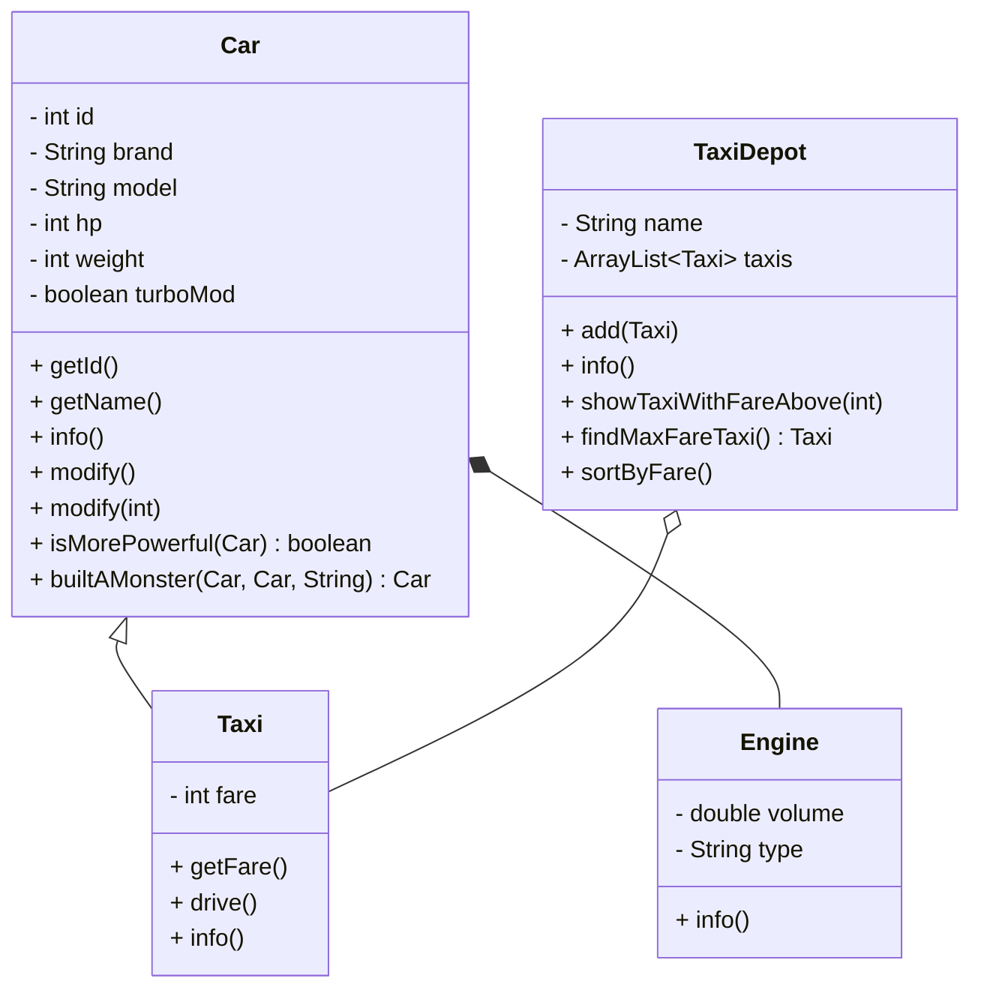

# ЛАБОРАТОРНА РОБОТА 2

## “Відношення між класами”

**Виконав:** Семен Прохода ІП-з31

**Мета роботи:** дослідити механізм побудови класу в Java.

### Завдання до роботи:

**Варіант 2:** Клас „авто” – клас „таксопарк” – клас „таксі”

1. Створення та використання класів
   - Розробити класи згідно з варіантом, використовуючи класи з попередньої лабораторної.
   - Створити масив об'єктів батьківського класу.
   - Реалізувати спадкування, агрегування та залежність між класами.
   - Використати методи класів (у т.ч. перевизначені).
   - Розробити додаткові класи, що розширюють функціональність.
2. Вкладені та локальні класи :
   - Реалізувати вкладений клас у одному з класів.
   - Додати локальний клас у метод.
   - Дослідити доступ до полів і методів вкладеного та локального класів з різних частин програми.
3. Масиви об’єктів та їх обробка:
   - Створити масиви об'єктів у Java.
   - Реалізувати пошук елемента, знаходження мін/макс значення.
   - Реалізувати сортування та копіювання масиву.

### Лістинг програми:

#### `Car.java`

```java
package car;

public class Car {
    private static int nextId = 0;
    private int id;
    private String brand;
    private String model;
    private int hp;
    private int weight;
    private boolean turboMod;

    public Car() {
        id = nextId++;
        brand = "Porsche";
        model = "911 Dakar";
        hp = 480;
        weight = 1680;
        turboMod = false;
    }

    public Car(String brand, String model) {
        id = nextId++;
        this.brand = brand;
        this.model = model;
        hp = 200;
        weight = 1000;
        turboMod = false;
    }

    public Car(String brand, String model, int hp, int weight, boolean turboMod) {
        id = nextId++;
        this.brand = brand;
        this.model = model;
        this.hp = hp;
        this.weight = weight;
        this.turboMod = turboMod;
    }

    public int getId() {
        return id;
    }

    public String getName() {
        return brand + " " + model;
    }

    public void info() {
        System.out.printf("%s has %s HP. Weighs %s. %s modified.%n", this.getName(), hp, weight, turboMod ? "Turbo" : "Not");
    }

    // modify car by adding a turbine, if not modified.
    public void modify() {
        if (turboMod) {
            System.out.printf("%s is already modified.%n", this.getName());
        } else {
            turboMod = true;
            hp += 0.3 * hp;
            weight += 20;
            System.out.printf("%s modified.%n", this.getName());
        }
    }

    // modify car by adding turbines, if not modified.
    public void modify(int turbines) {
        if (turboMod) {
            System.out.printf("%s is already modified.%n", this.getName());
        } else if (turbines > 4) {
            System.out.printf("%s is too many for modification of %s.%n", turbines, this.getName());
        } else if (turbines < 1) {
            System.out.printf("there must be at least 1 turbine to modify %s.%n", this.getName());
        } else {
            turboMod = true;
            hp += hp * (0.1 + 0.2 * turbines);
            weight += 20 * turbines;
            System.out.printf("%s modified.%n", this.getName());
        }
    }

    public boolean isMorePowerful(Car car) {
        return (this.hp > car.hp);
    }

    // built a monster car from 2 other cars
    public static Car builtAMonster(Car car1, Car car2, String monsterModel) {
        int monsterHP = (int) ((car1.hp + car2.hp) * 0.9);
        int monsterWeight = car1.weight + car2.weight;
        boolean monsterTurbo = car1.turboMod || car2.turboMod;
        return new Car("Monster", monsterModel, monsterHP, monsterWeight, monsterTurbo);
    }

    // вкладений клас
    public static class Engine {
        private double volume;
        private String type;

        public Engine(double volume, String type) {
            this.volume = volume;
            this.type = type;
        }

        public void info() {
            System.out.printf("Engine volume: %s, type: %s%n", volume, type);
        }
    }
}
```

#### `Taxi.java`

```java
package car;

// наслідування класу Car -> Taxi
public class Taxi extends Car {
    private int fare;

    public Taxi(String brand, String model, int hp, int weight, boolean turboMod, int fare) {
        super(brand, model, hp, weight, turboMod);
        this.fare = fare;
    }

    public int getFare() {
        return fare;
    }

    public void drive() {
        System.out.printf("%s is driving. Fare: %d UAH%n", getName(), fare);
    }

    @Override
    public void info() {
        super.info();
        System.out.printf("Taxi fare: %d UAH%n", fare);
    }
}
```

#### `TaxiDepot.java`

```java
package car;

import java.util.ArrayList;
import java.util.Comparator;

public class TaxiDepot {
    private String name;
    // агрегування класів TaxiDepot -> Taxi
    private ArrayList<Taxi> taxis;

    public TaxiDepot(String name) {
        this.name = name;
        taxis = new ArrayList<>();
    }

    public void add(Taxi taxi) {
        taxis.add(taxi);
    }

    public void info() {
        System.out.printf("Taxi depot: %s%n", name);
        for (Taxi taxi : taxis) {
            taxi.info();
            System.out.println();
        }
    }

    // відшукання Taxi (елемента/-ів) які дорожчі від...
    public void showTaxiWithFareAbove(int minFare) {
        // локальний клас
        class FareFilter {
            void show() {
                System.out.printf("Taxis with fare above %s:%n", minFare);

                for (Taxi taxi : taxis)
                    if (taxi.getFare() > minFare)
                        System.out.printf("%s: %s%n", taxi.getName(), taxi.getFare());
            }
        }
        FareFilter filter = new FareFilter();
        filter.show();
    }

    // відшукання Taxi з максимальною вартістю проїзда
    public Taxi findMaxFareTaxi() {
        Taxi maxFareTaxi = null;
        int maxFare = Integer.MIN_VALUE;
        for (Taxi taxi : taxis)
            if (taxi.getFare() > maxFare) {
                maxFare = taxi.getFare();
                maxFareTaxi = taxi;
            }
        return maxFareTaxi;
    }

    // сортування Taxi в депо
    public void sortByFare() {
        taxis.sort(Comparator.comparingInt(Taxi::getFare));
    }
}
```

#### `Main.java`

```java
import car.Car;
import car.Taxi;
import car.TaxiDepot;

public class Main {
    public static void main(String[] args) {
        // масив
        Car[] cars = {
                new Car("Toyota", "Corolla", 150, 1300, false),
                new Taxi("Ford", "Mondeo", 180, 1400, true, 50),
                new Taxi("Mercedes", "E-class", 250, 1600, true, 65),
                new Car("Audi", "A4", 200, 1450, false),
                new Taxi("Skoda", "Superb", 170, 1350, false, 55)
        };

        for (Car car : cars) {
            car.info();
            if (car instanceof Taxi taxi)
                taxi.drive();
            System.out.println();
        }

        TaxiDepot depot = new TaxiDepot("CityTaxi");
        for (Car car : cars)
            if (car instanceof Taxi taxi)
                depot.add(taxi);

        depot.info();

        depot.showTaxiWithFareAbove(50);
        System.out.println();

        System.out.printf("Max fare: %s%n%n", depot.findMaxFareTaxi().getName());

        depot.sortByFare();
        System.out.printf("Sorted Taxi in depot:%n");
        depot.info();

        Taxi.Engine engine = new Taxi.Engine(2.0, "Diesel");
        engine.info();
        System.out.println();

    }
}
```

### Результати тестування класу:

```java
for (Car car : cars) {
    car.info();
    if (car instanceof Taxi taxi)
        taxi.drive();
    System.out.println();
}
```

#### Output:

```
Toyota Corolla has 150 HP. Weighs 1300. Not modified.

Ford Mondeo has 180 HP. Weighs 1400. Turbo modified.
Taxi fare: 50 UAH
Ford Mondeo is driving. Fare: 50 UAH

Mercedes E-class has 250 HP. Weighs 1600. Turbo modified.
Taxi fare: 65 UAH
Mercedes E-class is driving. Fare: 65 UAH

Audi A4 has 200 HP. Weighs 1450. Not modified.

Skoda Superb has 170 HP. Weighs 1350. Not modified.
Taxi fare: 55 UAH
Skoda Superb is driving. Fare: 55 UAH
```

---

```java
depot.info();
```

#### Output:

```
Taxi depot: CityTaxi
Ford Mondeo has 180 HP. Weighs 1400. Turbo modified.
Taxi fare: 50 UAH

Mercedes E-class has 250 HP. Weighs 1600. Turbo modified.
Taxi fare: 65 UAH

Skoda Superb has 170 HP. Weighs 1350. Not modified.
Taxi fare: 55 UAH
```

---

```java
depot.showTaxiWithFareAbove(50);
System.out.println();
```

#### Output:

```
Taxis with fare above 50:
Mercedes E-class: 65
Skoda Superb: 55
```

---

```java
System.out.printf("Max fare: %s%n%n", depot.findMaxFareTaxi().getName());
```

#### Output:

```
Max fare: Mercedes E-class
```

---

```java
depot.sortByFare();
System.out.printf("Sorted Taxi in depot:%n");
depot.info();
```

#### Output:

```
Sorted Taxi in depot:
Taxi depot: CityTaxi
Ford Mondeo has 180 HP. Weighs 1400. Turbo modified.
Taxi fare: 50 UAH

Skoda Superb has 170 HP. Weighs 1350. Not modified.
Taxi fare: 55 UAH

Mercedes E-class has 250 HP. Weighs 1600. Turbo modified.
Taxi fare: 65 UAH
```

---

```java
Taxi.Engine engine = new Taxi.Engine(2.0, "Diesel");
engine.info();
System.out.println();
```

#### Output:

```
Engine volume: 2.0, type: Diesel
```

---

### Результати дослідження відношення спадкування:

1. Клас `Taxi` успадкував усі методи та поля від `Car`.
2. `Taxi` має власне поле `fare`, метод `drive` та перевизначений метод `info`
3. У коді застосовано `super` для доступу до методів батьківського класу.
4. Клас `TaxiDepot` агрегує об'єкти `Taxi` (массив таксі).
5. Використовується локальний клас `FareFilter` для міні-фільтрації за вартістю проїзда

---

### Діаграма класів:



---

- `Taxi` → наслідує `Car`
- `TaxiDepot` → агрегує `Taxi`
- `Engine` → вкладений клас у `Car`

### Висновки:

- **Переваги:**
    - Менше дублювання коду.
    - Зручно додавати нову функціональність.
    - Підтримка поліморфізму.
- **Недоліки:**
    - Залежність від батьківського класу.
    - Може ускладнити структуру коду.

**Висновок:** спадкування корисний інструмент для створення ієрархії класів, але його потрібно використовувати лише тоді, коли між класами існує зв’язок "is a". 
